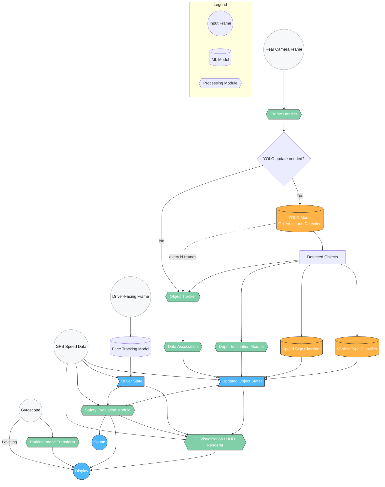

```mermaid
graph TD;
    %% Legend
    subgraph Legend
        Video_Frame((Input Frame))
        ML_Model[(ML Model)]
        Processing_Module{{Processing Module}}
    end

    %% Inputs
    Rear_Input_Frame((Rear Camera Frame))
    Driver_Input_Frame((Driver-Facing Frame))
    GPS_Speed_Data((GPS Speed Data))
    Gyroscope((Gyroscope))

    %% Rear camera pipeline
    Rear_Input_Frame --> Frame_Handler{{Frame Handler}}
    Frame_Handler --> Update_Tracks{YOLO update needed?}

    %% YOLO detection
    Update_Tracks -- Yes --> YOLO[(YOLO Model<br/>Object + Lane Detection)]
    YOLO --> Detected_Objects[Detected Objects]
    Detected_Objects --> Vehicle_Type_Est[(Vehicle Type Classifier)]
    Detected_Objects --> Speed_Sign_Cls[(Speed Sign Classifier)]
    Detected_Objects --> Depth_Est{{Depth Estimation Module}}
    Detected_Objects --> Tracker{{Object Tracker}}

    %% Tracking & data association
    Update_Tracks -- No --> Tracker
    Tracker --> Data_Association{{Data Association}}
    Data_Association --> Object_States>Updated Object States]
    Depth_Est --> Object_States
    Vehicle_Type_Est --> Object_States
    Speed_Sign_Cls --> Object_States
    GPS_Speed_Data --> Object_States

    %% Periodic YOLO refresh
    YOLO -. every N frames .-> Tracker

    %% Driver attention monitoring
    Driver_Input_Frame --> Face_Track[(Face Tracking Model)]
    Face_Track --> Driver_State>Driver State]
    GPS_Speed_Data --> Driver_State

    %% Visualization and output
    Object_States --> Renderer3D{{3D Visualization / HUD Renderer}}
    Driver_State --> Renderer3D
    Object_States --> Safety_Eval{{Safety Evaluation Module}}
    Driver_State --> Safety_Eval
    Safety_Eval --> Renderer3D
    GPS_Speed_Data --> Safety_Eval
    GPS_Speed_Data --> Renderer3D
    Renderer3D --> Display((Display))
    Safety_Eval --> Display
    Safety_Eval --> Sound((Sound))
    Gyroscope --> Parking_Transform{{Parking Image Transform}}
    Parking_Transform --> Display
    Gyroscope -- Leveling --> Display

    %% Notes
    %% Improved color contrast
    classDef input fill:#f6f8fa,stroke:#999,color:#111;
    classDef model fill:#ffb347,stroke:#333,color:#fff;
    classDef module fill:#80cfa9,stroke:#333,color:#fff;
    classDef output fill:#4db8ff,stroke:#333,color:#fff;
    class Rear_Input_Frame,Driver_Input_Frame,GPS_Speed_Data,Gyroscope input;
    class YOLO,Vehicle_Type_Est,Speed_Sign_Cls,Driver_Attn model;
    class Frame_Handler,Tracker,Data_Association,Depth_Est,Renderer3D,Safety_Eval,Parking_Transform module;
    class Object_States,System_Output,Driver_State,Display,Sound output;
```
